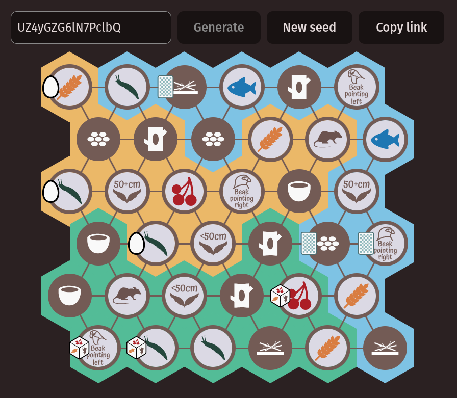

# Wingspan Randomizer

This project creates a random Duet Map from [Wingspan
Asia](https://stonemaiergames.com/games/wingspan/wingspan-asia/). Duet mode is
great, but it has the exact same map every game, so I hope this adds some spice
;)



The map is seedable with link sharing, enabling reproducible results. However, I
am actively working on the algorithm, so results may change between releases.

## Technologies used

- Main stack: [React](https://react.dev/), [TypeScript](https://www.typescriptlang.org/) and [Vite](https://vite.dev/)
- Icons: [SVG Repo](https://www.svgrepo.com) and [Inkscape](https://inkscape.org/)

## Local development

```
npm install
npm run dev
```

## To do

- The algorithm sometimes takes much longer (~200ms on my machine) because it
  gets stuck in a complicated state - could try to investigate how it's
  getting stuck and optimize this away
- Additional configuration with what aspects of the map to randomize
